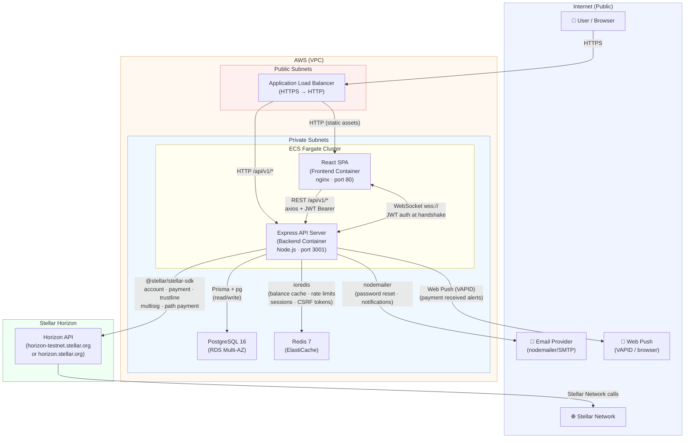

# System Architecture

This document is the canonical reference for the FuTuRe platform's component topology, data flows, and deployment model. It reflects the current production architecture. Planned changes are noted at the bottom.

## Diagram

---

## Components

### React SPA (Frontend)

A Vite-built React 18 application served as static files from an nginx container. It communicates with the backend exclusively through `VITE_API_URL` (pointing to `/api/v1`) via axios, and establishes a WebSocket connection for real-time events. State management uses React Context for app-wide state and React Query for all server-fetched data. Sentry is wired in for error tracking; i18next handles localisation.

### Express API Server (Backend)

A Node.js/Express application that owns all business logic. It applies the following middleware in order: response compression, CORS origin validation, security headers (Helmet), CSRF token enforcement, global rate limiting, request ID stamping, input sanitisation. Routes are versioned under `/api/v1/` and cover authentication, Stellar operations, transactions, notifications, compliance, multi-sig, streaming payments, analytics, and admin. Two background intervals run inside the server process: a streaming payment worker (60 s) and a multi-sig expiry sweeper (60 s). A background scheduler handles additional periodic tasks. OpenTelemetry traces are exported via OTLP-HTTP.

### Stellar Horizon Integration

The backend's `services/stellar.js` wraps `@stellar/stellar-sdk` and acts as the sole integration point with the Stellar network. It exposes account creation, balance queries (with Redis caching), payment submission, path payments, trustline management, multi-signature workflows, and fee-bump wrapping for low-balance accounts. All Horizon calls go through a circuit breaker and exponential-backoff retry (max 3 attempts). A latency monitor pings Horizon every 30 s and caches the result for health checks. The server advertises a `.well-known/stellar.toml` for federation support.

### PostgreSQL (RDS)

The system of record. Accessed via Prisma 7 over a `pg` connection pool (max 10, configurable). The backend reads and writes user accounts, transactions, payment streams, sessions, MFA settings, KYC records, AML alerts, notifications, contacts, and audit logs. Sensitive columns (password hashes, MFA secrets) are encrypted at rest at the application layer in addition to RDS storage encryption. A soft-delete extension automatically filters `deletedAt` records. In production the instance runs Multi-AZ with automated backups.

### Redis (ElastiCache)

A shared cache and coordination store, accessed via ioredis. Used for:

- **Balance cache** — Stellar account balances cached with a configurable TTL (default 30 s) to reduce Horizon round-trips.
- **Rate limiting** — Distributed rate limit counters (60 s window, 100 req/IP default; stricter limits on auth endpoints).
- **Session store** — Durable JWT session records with revocation support.
- **CSRF tokens** — Distributed token storage in production (in-memory in development).
- **Idempotency keys** — SETNX-based duplicate prevention for payment endpoints.

All Redis operations are fail-open: if Redis is unavailable the application continues without caching.

### WebSocket Notification Service

A `ws` WebSocket server mounted on the same HTTP server as Express. Clients authenticate at handshake time by passing a JWT as a query parameter or `Authorization` header; unauthenticated connections are closed with code 4001. After authentication, clients subscribe to a Stellar public key. The backend calls `broadcastToAccount(publicKey, payload)` to push events (payment received, stream status, etc.) to all active sockets for that key. If the client is offline, messages are queued in-memory (FIFO, max 100) and flushed on reconnect. Messages are signed with HMAC-SHA256 before delivery. Heartbeat pings fire every 30 s to detect stale connections.

### Authentication Layer

JWT-based with two token types: a short-lived access token (15 min) in the `Authorization` header and a long-lived refresh token (7 days) in an HttpOnly `SameSite=Strict` cookie. The `requireAuth` middleware validates the token and checks the session ID against the session store, so tokens can be invalidated server-side. Supporting security features include TOTP-based MFA, WebAuthn biometric re-auth for large transfers, account lockout after repeated failed logins, and an OAuth2 Google login path.

### External Services

| Service           | Purpose                                          | Integration point                              |
| ----------------- | ------------------------------------------------ | ---------------------------------------------- |
| SMTP (nodemailer) | Password reset emails, notification emails       | `notifications/channels/email.js`              |
| Web Push (VAPID)  | Browser push notifications for incoming payments | `notifications/webPush.js`                     |
| Twilio SMS        | Optional SMS notifications                       | `notifications/channels/sms.js` (optional dep) |
| Stellar Friendbot | Testnet account funding                          | `services/stellar.js` (testnet only)           |

---

## Payment Flow Walkthrough

The following describes what happens when a logged-in user sends a payment.

1. **User submits the payment form.** The React SPA calls `POST /api/v1/stellar/send` with `{ sourceSecret, destination, amount, assetCode, memo }`. The axios interceptor attaches the JWT Bearer token and a correlation ID header.

2. **Rate limiting and auth.** The Express middleware chain checks the rate limit bucket (Redis), then `requireAuth` validates the JWT and confirms the session is still active in Redis/PostgreSQL.

3. **CSRF check.** The CSRF middleware verifies the `X-CSRF-Token` header matches the token stored for this session.

4. **Idempotency check.** The payment handler performs a Redis SETNX on a key derived from the request parameters. Duplicate in-flight requests return a 409 immediately.

5. **Horizon account load.** `sendPayment()` calls `getHorizonServer().loadAccount(sourcePublicKey)` via the circuit breaker to fetch the current sequence number and XLM balance.

6. **Fee-bump decision.** If the sender's XLM balance is below `FEE_BUMP_THRESHOLD_XLM` (default 2 XLM) and `PLATFORM_FEE_ACCOUNT_SECRET` is configured, the transaction is wrapped in a `FeeBumpTransaction` so the platform pays the fee.

7. **Transaction build and sign.** A Stellar `Transaction` is built (with optional memo), signed with the source account's secret key, and submitted to Horizon via `withHorizonRetry`.

8. **Database write.** On success, the backend upserts both sender and recipient `User` rows and inserts a `Transaction` record (hash, amount, asset, ledger, memo) inside a Prisma `$transaction`.

9. **Balance cache invalidation.** The sender's balance cache key is deleted from Redis so the next balance query returns fresh data from Horizon.

10. **Event sourcing.** A `PaymentSent` event is published to the event monitor for audit and projection purposes.

11. **WebSocket notification.** `broadcastToAccount(destination, { type: 'payment_received', ... })` pushes a real-time event to any active browser sessions of the recipient.

12. **Web Push notification.** If the recipient has a registered push subscription, a Web Push message is dispatched directly to the browser push endpoint.

13. **Response.** The backend returns `{ hash, ledger, success, feeBump }` to the frontend, which updates the React Query cache and displays the confirmation.

---

## Deployment Topology

The application runs on AWS, managed by Terraform.

| Resource      | AWS service                     | Notes                                                                                              |
| ------------- | ------------------------------- | -------------------------------------------------------------------------------------------------- |
| Compute       | ECS Fargate                     | Frontend and backend as separate task definitions; FARGATE_SPOT for non-prod                       |
| Load balancer | Application Load Balancer       | Terminates TLS; routes `/api/*` and WebSocket upgrades to backend, all other paths to frontend     |
| Database      | RDS PostgreSQL 16               | Multi-AZ in production; gp3 storage, automated daily backups, Secrets Manager password rotation    |
| Cache         | ElastiCache Redis 7.1           | Single-node cluster; snapshots enabled                                                             |
| Networking    | VPC with public/private subnets | ALB in public subnets; ECS tasks, RDS, and Redis in private subnets with no direct internet access |
| Secrets       | AWS Secrets Manager             | JWT secret, stream encryption key, backup encryption key, DB credentials                           |
| Logs          | CloudWatch Logs                 | 30-day retention for backend ECS task logs                                                         |
| Metrics       | Prometheus `/metrics`           | Scraped by external Prometheus; CloudWatch Container Insights also enabled                         |
| Tracing       | OpenTelemetry (OTLP-HTTP)       | Traces exported from the backend at startup                                                        |

For local development, a `docker-compose.yml` at the repository root spins up the full stack: `postgres:15-alpine`, `redis:7-alpine`, the backend with hot-reload (`node --watch`), and the frontend Vite dev server.

---

## Planned

- **PgBouncer sidecar** — transaction-mode connection pooling to reduce RDS connection count under load (env var `DATABASE_POOL_URL` is already wired in).
- **TypeScript migration** — incremental JS → TS conversion tracked in [`docs/typescript-migration.md`](typescript-migration.md).
- **Horizontal WebSocket scaling** — Redis Pub/Sub adapter to allow `broadcastToAccount` to work across multiple backend replicas.
